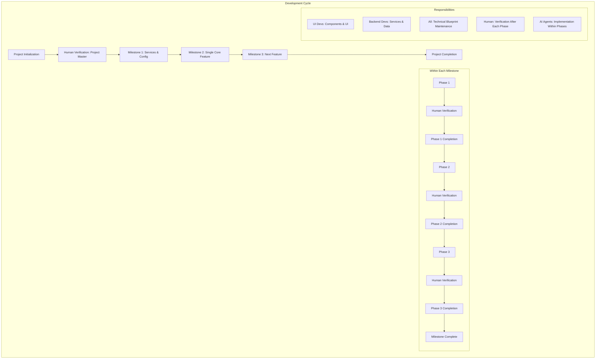

# Project Start Prompt

## Project Description
---
Please see project_description.md
---

## Development Strategy and Structure

### Development Cycle Overview
This project follows a milestone-based development cycle with clear ownership and responsibilities throughout. Each milestone progresses through defined phases, with verification checkpoints between them. Development begins with initial planning and service configuration (Milestone 1), followed by core functionality implementation in subsequent milestones. Within each milestone, we follow a UI-First approach, building interfaces before logic. Development responsibilities are clearly defined: UI developers own component creation and styling, backend developers own service implementation and data flow, while all team members share responsibility for maintaining the technical blueprint. Human verification is required at phase transitions and milestone completions, with AI agents handling implementation according to specifications within phases. This ensures continuous progress while maintaining quality and adherence to the project's technical standards.

This project follows a UI-First Incremental Development approach optimized for continuity between LLM sessions and clear progress tracking. We build interfaces first, then implement simplified business logic, and finally increase complexity as needed. Throughout development, we adhere to the DRY (Don't Repeat Yourself) principle across database schema design, interface components, function implementation, and monorepo structure to ensure maintainability, reduce code duplication, and promote reusability.

### Project Organization
- **Root Directory**
  - `project_master.md`: Comprehensive document containing both the high-level vision/objectives and planned project roadmap with milestones and timeline
  - `000_start_every_session_here.md`: Entry point document that defines key agent behaviors and directs the agent to the appropriate milestone and phase documents to review before beginning work. This file serves as a router rather than a comprehensive summary, ensuring agents follow consistent patterns while obtaining detailed context from the relevant project documents. **CRITICAL INSTRUCTION**: This document must explicitly instruct developers to thoroughly review the `technical_blueprint.md` before starting any work to ensure understanding of existing implementations and prevent duplicate functionality.
  - `technical_blueprint.md`: Single source of truth for all technical decisions, schemas, patterns, and implementations across the project. This document includes dedicated sections for each feature (replacing individual reference files) to ensure comprehensive, centralized documentation of all technical aspects.

### Project Master Document
The `project_master.md` serves as the comprehensive project planning and vision document:

1. **Vision Section**:
   - Project overview and purpose
   - Core value proposition
   - Target audience and user personas
   - Success metrics and goals

2. **Roadmap Section**:
   - Complete milestone timeline
   - Prioritization strategy
   - Resource allocation plans
   - Release schedule and versioning strategy

3. **Maintenance Protocol**:
   - Updates to this document should focus on high-level goals and planning
   - Technical details should remain in the technical blueprint
   - Document should be reviewed at major project pivots or directional changes

### Technical Blueprint
The `technical_blueprint.md` document serves as the comprehensive, single source of truth for all technical aspects of the project to ensure consistency and adherence to the DRY principle:

1. **Purpose and Structure**:
   - Acts as the authoritative reference for all technical elements
   - Must be consulted before implementing any new feature or making technical decisions
   - Organized in clear sections with table of contents for easy navigation

2. **Required Sections**:
   - **Data Schema**: Complete and current database schema with field definitions, relationships, indexes, and constraints
   - **API Endpoints**: All endpoints with parameters, response formats, and authentication requirements
   - **Component Library**: Reusable UI components with props, behaviors, and usage examples
   - **Utility Functions**: Shared functions with signatures, purposes, and usage patterns
   - **State Management**: Global and local state structures with access patterns
   - **Authentication Flow**: Complete authentication process and security implementations
   - **External Services**: Integration details for all third-party services with configuration requirements
   - **Design Patterns**: Standardized patterns for common operations (CRUD, error handling, etc.)
   - **Features**: Dedicated subsections for each feature in the application, replacing individual reference files:
     - Each feature section must include:
       - Feature purpose and description
       - Technical implementation details
       - Dependencies and relationships with other components
       - Current development status and progress
       - Planned enhancements or known limitations

3. **Maintenance Protocol**:
   - Every technical implementation **must** be documented in this file before considered complete
   - New implementations require checking this document first to avoid duplication
   - Updates to this document should be atomic and reflect the current state of the codebase
   - Document should be reviewed at each milestone completion for accuracy and completeness
   - Major technical changes require human verification and approval in this document before implementation

## Session Workflow
1. Start by reviewing `000_start_every_session_here.md`
2. **Mandatory Technical Review**: 
   - Check current milestone and phase status
   - Review `technical_blueprint.md` thoroughly to understand all existing implementations, data structures, patterns, and feature documentation
   - Any uncertainty about existing implementations must be resolved by consulting the technical blueprint before proceeding

3. Complete next items in current phase checklist, following the UI-first approach:
   - Prioritize interface components before backend implementation
   - Use mock data for UI development when actual data sources aren't ready
   - Implement simplified business logic to verify interface functionality
   - Only after verification, increase complexity of implementation

4. **Document Updates (Required)**:
   - Update `technical_blueprint.md` with any new implementations, patterns, modifications, or feature progress
   - Ensure the feature section within the technical blueprint is updated with current status and details
   - Update `project_master.md` if there are changes to project direction or milestone timelines

5. **Consistency Verification**:
   - Before completing the session, verify that all new implementations follow patterns documented in the technical blueprint
   - Ensure no duplicate functionality has been created
   - Confirm that shared components/functions are used appropriately

6. Document progress and next steps before ending session

### UI-First Incremental Development Sequence
For each feature or milestone, follow this progression:
1. **Interface First**: Design and implement the user interface with mock data
2. **Simple Logic**: Implement minimal business logic to make the interface functional
3. **Incremental Complexity**: Gradually enhance functionality with more robust implementation
4. **Verification**: AI agent pauses implementation and waits for human verification of the feature

### Milestone Structure Setup Process

1. **Initial Milestone Planning**:
   - Identify all major milestones for the project, keeping each milestone focused and manageable
   - **First milestone requirement**: `milestone_1_current/` must always focus on establishing service provider connections and configuration:
     - Set up authentication with required services (Supabase, Netlify, Claude API, Firebase, etc.)
     - Create and populate a shared `.env` file with all necessary credentials and API keys
     - Document connection procedures in reference files for future maintenance
   - Create folders for remaining milestones with appropriate status suffixes:
     - `milestone_2_planned/`
     - `milestone_3_planned/`
     - etc.

2. **Create Milestone Overviews**:
   - For EACH milestone, create `milestone_overview.md` with:
     - Clear objectives
     - Success criteria
     - Technical dependencies
     - Verification requirements

3. **Phase Management**:
   - Only for the CURRENT milestone:
     - Create `phase_1_checklist_current.md` with initial tasks
   - Do NOT create phase checklists for planned milestones
   
4. **Progression Workflow**:
   - When a phase is completed:
     - Rename from `phase_n_checklist_current.md` to `phase_n_checklist_done.md`
     - Create next phase as `phase_(n+1)_checklist_current.md`
   
   - When a milestone is completed:
     - Rename folder from `milestone_n_current/` to `milestone_n_done/`
     - Rename next milestone from `milestone_(n+1)_planned/` to `milestone_(n+1)_current/`
     - Review and update `milestone_overview.md` in the new current milestone folder based on previous implementation experience
     - Only after review, create `phase_1_checklist_current.md` in the new current milestone folder

### Continuity Mechanism
- Each session must update the current phase checklist with completed items
- At end of session, update `000_start_every_session_here.md` to point to current milestone and phase files
- The `technical_blueprint.md` document must be updated for any technical decisions, implementations, or modifications, including feature-specific details that were previously in reference files
- The `project_master.md` should be reviewed periodically to ensure alignment with current direction